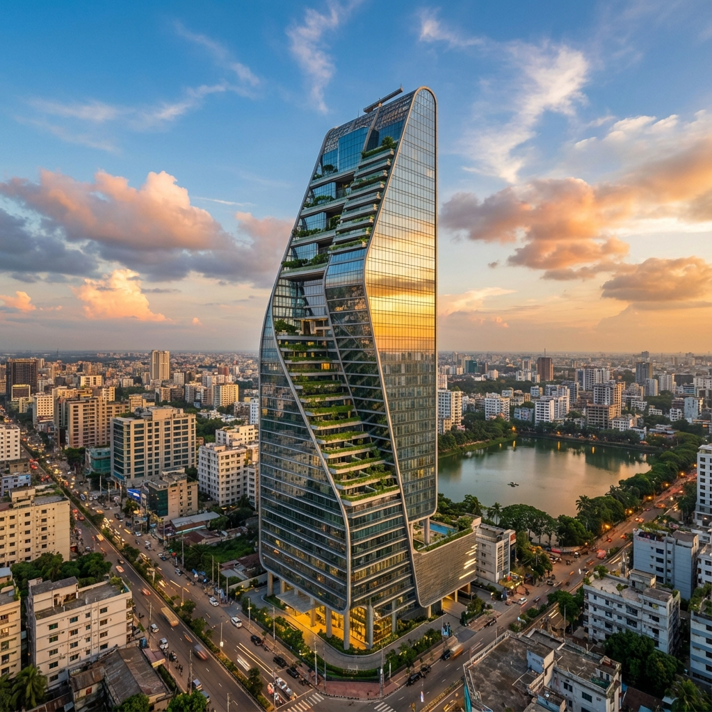

# HAVENTECH DEVELOPERS LIMITED

A modern, responsive website for **Haventech Developers Limited** - a premier real estate developer in Dhaka, Bangladesh.



## 🏠 About

Haventech Developers Limited specializes in luxury residential properties, offering:

- **Renting Flats** - Premium rental apartments in prime locations
- **Selling Flats** - High-quality residential apartments for investment
- **Building Management** - Comprehensive property management services

## ✨ Features

- 📱 Fully responsive design (mobile-first approach)
- 🎨 Modern UI with smooth animations
- 🖼️ AI-generated property images
- 📍 Embedded Google Maps location
- 📝 SEO optimized
- ⚡ Fast loading & lightweight

## 🛠️ Tech Stack

- HTML5
- CSS3 (Vanilla CSS with CSS Variables)
- JavaScript (ES6+)
- Font Awesome Icons
- Google Fonts (Poppins, Inter, Playfair Display)

## 📂 Project Structure

```
├── index.html          # Main HTML file
├── styles.css          # All CSS styles
├── script.js           # JavaScript functionality
└── assets/
    └── images/         # All image assets
        ├── logo.png
        ├── favicon.png
        ├── hero.png
        └── ...
```

## 🚀 Getting Started

1. Clone the repository:

   ```bash
   git clone https://github.com/amritodey1100/HAVENTECH-DEVELOPERS-LIMITED.git
   ```

2. Open `index.html` in your browser

## 📞 Contact

- **Phone:** 01977 49 29 00
- **Email:** info@technodol.com
- **Head Office:** 295/Ja/5 Sikder Real State, Rayer Bazer, 1209 Dhaka
- **Branch:** Kachua Powroshava, Chandpur

## 📄 License

This project is licensed under the MIT License - see the [LICENSE](LICENSE) file for details.

---

Developed by [Technodol](https://technodol.com) © 2025
